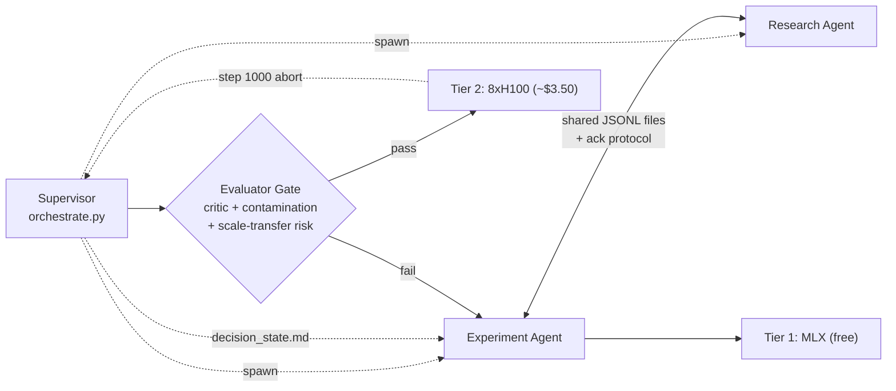
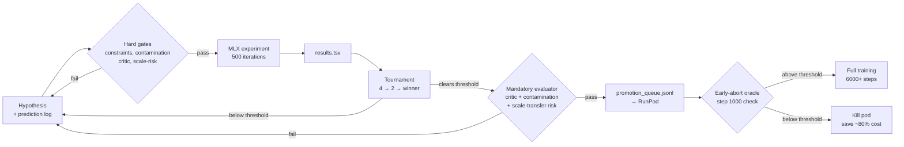
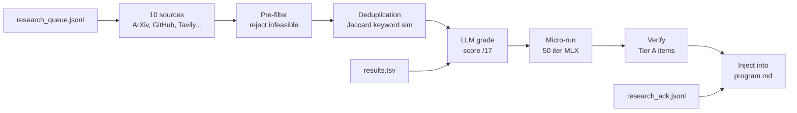

# Parameter Golf Autoresearch


---

An autonomous experiment loop for [OpenAI's Parameter Golf](https://github.com/openai/parameter-golf) challenge, expanded from the brilliance of Karpathy's [autoresearch](https://github.com/karpathy/autoresearch).

---

[Parameter Golf](https://github.com/openai/parameter-golf) asks you to train the best language model you can under simultaneous hard constraints: the entire artifact — code plus compressed weights — must fit in 16MB, training gets 10 minutes on 8x H100 SXMs, and the model can't phone home during evaluation. The metric is bits per byte on FineWeb. It's a compression problem dressed as an ML competition, and the leaderboard moves fast — the current SOTA (1.1194 bpb) combines int6 quantization, parameter banking, test-time training, and a custom bigram tokenizer, all inside a 16MB envelope. Staying competitive means tracking what others are shipping and testing new ideas quickly.

Karpathy's [autoresearch](https://github.com/karpathy/autoresearch) demonstrated that an agent can run this kind of experiment loop autonomously: modify a training script, train, evaluate, keep or revert, repeat. The core loop is simple and it works — about 12 experiments per hour on a single GPU, designed to run overnight. I wanted to apply that same idea to Parameter Golf, but the challenge adds constraints that autoresearch wasn't designed for. The official runs require 8x H100s at ~$20/hour, so you can't just loop freely — you need cost-aware gating between cheap local validation and expensive official runs. The competition is also a moving target; an agent that only sees its own code will miss techniques that other competitors publish mid-challenge. And the artifact size constraint needs continuous enforcement, not just loss optimization.

This project keeps autoresearch's modify-train-evaluate-decide loop at the center, then splits the intelligence into two independent agents: an experiment agent that designs and runs hypotheses, and a research agent that continuously discovers and synthesizes relevant work from 10 sources. They communicate via shared JSONL files with deduplication, fulfillment tracking, and an acknowledgment protocol so the research agent knows what has been consumed. A thin process supervisor manages infrastructure lifecycle and generates a compact decision-state handoff before each agent cycle — structured context engineering instead of dumping everything into a monolithic file.

Around them: a two-tier compute model that uses local MLX runs as a free scratchpad before promoting to RunPod, a mandatory evaluator gate (critic review + contamination detection + scale-transfer risk assessment) that blocks promotion before expensive compute is spent, an early-abort oracle that kills underperforming H100 runs at step 1000 before they burn the full budget, deterministic hard gates for constraints, a budget manager with atexit pod termination as a safety net, and an adaptive intelligence layer that synthesizes experiment history into strategy, tracks hypotheses with structured predictions and outcomes, gates promotion on a dynamic threshold, and tests hypotheses in tournament brackets. MLX is your scratchpad; RunPod is your printer.

## Architecture

The system runs as three processes: a thin process supervisor and two independent Claude Code (Opus 4.6) agents — one for experiments, one for research. The agents communicate via shared JSONL files with deduplication and acknowledgment tracking. The supervisor generates a compact decision-state handoff before each agent cycle and manages infrastructure lifecycle.



## How It Works

The experiment agent and research agent run as independent Claude Code instances, each with full autonomy over their domain. Neither blocks the other. The process supervisor (`orchestrate.py`) has no LLM logic — it spawns both agents, monitors their health (restarting on crash, up to 5 attempts), and polls `promotion_queue.jsonl` for Tier 2 promotion requests. Before each experiment agent cycle, the supervisor generates a compact `decision_state.md` handoff containing the current best score, last 5 experiments, unacknowledged research findings, dead ends, budget state, and learned rules from hypothesis tracking — structured context engineering that gives the agent exactly what it needs without token waste.

When a promotion arrives, the supervisor runs a **mandatory evaluator gate** before any expensive compute is spent: critic review (artifact size, diff size, similarity to past failures), contamination detection (AST-based validation data leakage), and scale-transfer risk assessment (flags techniques like loss functions that behave differently at 500 vs 7000 training steps). Only if all gates pass does the supervisor proceed to the RunPod lifecycle: budget check, threshold check, pod creation via API, code sync and training execution via SSH, result retrieval, and pod termination. An **early-abort oracle** monitors step-1000 val_bpb during training and kills underperforming runs before they burn the full budget.

### Experiment Agent

The experiment agent designs hypotheses, implements them in `train_gpt_mlx.py`, and runs local experiments. Every hypothesis is recorded in a structured hypothesis log with its prediction, basis, and scale-transfer risk. Hypotheses must pass deterministic hard gates before any code is written or compute is spent.



**Hard gates** (the agent cannot override these):
1. **Constraint check** — artifact size, training steps, quantization MSE, entropy bounds, memory footprint (`compute/constraints.py`)
2. **Contamination check** — AST analysis for validation data leakage, score plausibility (`compute/contamination.py`)
3. **Critic gate** — artifact size, diff size, similarity to past failures, scale-transfer risk assessment (`research/critic.py`)
4. **Scale-transfer risk** — classifies techniques by likelihood of behaving differently at 500 vs 7000 steps; high-risk techniques (loss functions, optimizer schedules) flagged before H100 promotion
5. **Promotion threshold** — dynamic, scales with SOTA distance; adaptive fallback after 10 rejections (`compute/threshold.py`)
6. **Budget check** — reserve floor and rate limiting for Tier 2 (`compute/budget.py`)
7. **Early-abort oracle** — monitors step-1000 val_bpb during H100 training; kills runs below threshold, saving ~80% of cost

**Tournament mode** (`python orchestrate.py --tournament`) generates 4 candidate modifications, runs each for 100 iterations in an elimination round, advances the top 2 to a full 500-iteration run, and reports the winner.

### Research Agent

The research agent continuously discovers, grades, and synthesizes research. It operates in two modes: autonomous (drives its own search cadence) and reactive (responds to experiment agent requests via `research_queue.jsonl`). Research queue entries are tracked with a fulfillment protocol — once a reactive request is answered, it's marked as fulfilled so the agent isn't re-triggered for the same question.



**Competitive intelligence:** The agent monitors the Parameter Golf leaderboard and competitor repos (`openai/parameter-golf`, `KellerJordan/modded-nanogpt`, `karpathy/autoresearch`). When SOTA moves, it updates the target, signals the experiment agent, and investigates the technique. Any technique extracted from a competitor must pass the full constraint validation suite — accepted leaderboard submissions are prioritized as known-legal.

### Budget and Pod Safety

`BudgetManager.can_submit()` blocks Tier 2 submissions below the reserve floor, with a one-hour rate limit on consecutive runs (enforced by tracking the last submission timestamp in `budget.json`). `RunPodClient._cleanup_all` registers as both `atexit` and `SIGTERM` handler — if the supervisor dies, active pods get terminated. At $20/hour for 8xH100s, a forgotten pod costs ~$0.33/minute. The budget manager also tracks the best H100 val_bpb and uses it to auto-calibrate the early-abort threshold — new runs that underperform at step 1000 are killed before burning the full training budget.

## Research Pipeline Details

The **constraint pre-filter** extracts parameter counts and bit-widths from titles and abstracts using regex (e.g., "50M params", "int4", "6-bit"). Items where both are extractable and `feasibility_report()` says infeasible get auto-rejected to Tier C — no LLM tokens spent. Items where extraction fails pass through (fail-open).

Each paper that survives the pre-filter passes through a **deduplication gate** — Jaccard keyword similarity (threshold 0.6) is computed against the last 50 research results. Near-duplicates are silently dropped, preventing the unbounded repetition of the same technique across research cycles.

Papers that survive deduplication get scored across six dimensions: `bpb_impact`, `size_compatibility`, `time_compatibility`, `implementability`, `novelty`, and `scale_transfer_risk`. The last dimension uses inverted scoring — techniques that interact with training dynamics (loss functions, optimizer modifications, gradient scaling) score low because they're likely to behave differently at 500 local steps vs 7000 H100 steps, while architecture-independent techniques (compression, data loading) score high. The grader knows the current SOTA, the techniques already on the leaderboard, and the hard artifact and training constraints. A paper that requires a new pip dependency, pushes the 16MB limit, or would exceed 600s of training time scores low regardless of the idea's quality. The top 12 scored items, by default, get injected into `program.md`.

Before Tier A items proceed to expensive verification, a **post-grade feasibility gate** runs the same constraint check against the LLM's grading summary. This catches cases where the LLM scored `size_compatibility` high but the actual numbers don't fit.

After grading and verification, a **reflection cycle** synthesizes experiment history into strategic guidance — identifying failure patterns, exhausted vs. promising search dimensions, and recommending next experiments. The output is written to `strategy.md` and injected into `program.md` so the agent sees synthesized strategic state alongside raw data.

The reflection also maintains a **technique adjacency map** (`technique_map.json`) — a graph of technique relationships with status labels (proven, exploring, dead_end, untried). This gives the agent a structured view of the search space: which branches are dead ends, which show monotonic improvement, and which remain unexplored.

## Constraint Calculator

Before writing code for a new experiment, the agent validates mathematical feasibility:

```bash
python orchestrate.py --check-constraints --params 23000000 --bits 6 --code-bytes 30000
```

This checks:
- **Artifact size** — will N parameters at B bits fit in 16MB after zstd compression?
- **Training steps** — how many steps fit in 600s at a given batch size?
- **Quantization MSE** — what's the theoretical noise floor at this bit-width?
- **Entropy bound** — can zstd physically compress these weights below 16MB?
- **Memory footprint** — will model weights + optimizer state + gradients + activations fit in H100 VRAM (80GB)?

The calculator auto-calibrates from weight files on disk when available, using observed compression ratios and weight statistics instead of theoretical defaults. If the report says NOT FEASIBLE, the idea is mathematically doomed and the agent redesigns before wasting a training run.

A separate **contamination detection** module (`compute/contamination.py`) provides deterministic TTT leakage detection. It parses training scripts via AST to find validation data references in training loops, and checks whether val_bpb improvements are plausibly explained by training loss changes. These are hard gates — a failed contamination check blocks the experiment.

## Micro-Experiment Runner

The research agent can sanity-check hypotheses before recommending them to the experiment agent. The **micro-runner** (`research/tools/micro_run.py`) takes a unified diff against `train_gpt_mlx.py`, applies it to a temporary copy, runs 50 iterations on synthetic data (~15 seconds on an M4 MacBook Air), and returns structured metrics: whether the code crashes, whether loss decreases, timing per iteration, and artifact size.

This isn't a full experiment — it runs on random tokens, not FineWeb. But it catches syntax errors, import failures, NaN divergence, and obvious non-starters before they waste experiment cycles. The research agent invokes it after grading a promising technique (Tier A/B) and uses the result to decide whether to recommend the technique with empirical backing or discard it.

## Repository Structure

```
parameter-golf-autoresearch/
├── orchestrate.py          # process supervisor: spawn agents, monitor health, RunPod lifecycle,
│                           #   mandatory evaluator gate, early-abort detection, decision-state gen
├── agents/
│   ├── experiment_agent.md # system prompt for the experiment agent (Opus 4.6)
│   ├── research_agent.md   # system prompt for the research agent (Opus 4.6)
│   ├── shared.py           # shared communication: Message dataclass, JSONL queue read/write,
│   │                       #   fulfillment tracking, acknowledgment protocol
│   ├── decision_state.py   # compact decision-state handoff generator (~2K tokens per cycle)
│   └── hypotheses.py       # structured hypothesis tracking: predictions, outcomes, learned rules
├── program.md              # agent working context: research, strategy, technique map, experiments
├── train_gpt_mlx.py        # Tier 1 training script (MLX, Apple Silicon)
├── train_gpt.py            # Tier 2 training script (PyTorch, torchrun, early-abort oracle)
├── measure_artifact.py     # artifact size check: code + zstd-compressed weights, <=16MB
├── compute/
│   ├── budget.py           # BudgetManager: spend tracking, reserve floor, rate limiting,
│   │                       #   best H100 bpb tracking for early-abort threshold
│   ├── threshold.py        # dynamic promotion threshold: scales with SOTA distance
│   ├── constraints.py      # mathematical feasibility: artifact, steps, MSE, entropy, memory
│   ├── contamination.py    # TTT leakage detection: AST analysis + score plausibility
│   ├── tournament.py       # tournament mode: generate -> eliminate -> finalize
│   ├── dashboard.py        # dashboard push client: experiment/research/budget metrics
│   ├── run_config.py       # run configuration validation and constraint checking
│   ├── runpod_client.py    # pod lifecycle: launch, poll, terminate, atexit cleanup
│   └── sync.py             # rsync push/pull and remote torchrun over SSH
├── research/
│   ├── fetch.py            # async fetch from 10 sources (agent-driven cadence)
│   ├── extract_params.py   # regex extraction of params/bits from text (pre-filter)
│   ├── grade.py            # LLM grading (/17 base) with constraint pre-filter + scale-transfer risk
│   ├── verify.py           # deep verification with post-grade feasibility gate
│   ├── reflect.py          # reflection cycle: strategy synthesis + technique map maintenance
│   ├── critic.py           # mandatory evaluator gate: artifact, diff, similarity, scale-transfer risk
│   ├── inject.py           # section injection into program.md + research_results.jsonl + dedup
│   ├── experiments.py      # read-only API for results.tsv, competitor data, source yield
│   ├── tools/
│   │   └── micro_run.py    # 50-iteration MLX micro-runner for hypothesis sanity-checking
│   └── sources/            # one module per source (arxiv, openreview, semantic_scholar, ...)
├── dashboard/              # SvelteKit monitoring dashboard (experiments, research, budget, strategy)
├── tests/                  # pytest suite (188 tests)
├── data/                   # FineWeb token data + tokenizer files
├── runpod_results/         # logs pulled from completed RunPod runs
├── results.tsv             # experiment history: commit, tier, val_bpb, cost, source_item
├── research_queue.jsonl    # experiment agent → research agent requests (with fulfillment tracking)
├── research_results.jsonl  # research agent → experiment agent findings (deduplicated)
├── research_ack.jsonl      # experiment agent acknowledgments of consumed research
├── hypotheses.jsonl        # structured hypothesis predictions and outcomes
├── promotion_queue.jsonl   # experiment agent → supervisor promotion requests
├── decision_state.md       # compact per-cycle handoff (generated by supervisor)
├── budget.json             # persisted spend state + best H100 bpb
├── strategy.md             # synthesized strategic guidance (generated by reflection)
├── technique_map.json      # technique relationship graph (generated by reflection)
├── raw_cache.jsonl         # fetched research items
└── graded_cache.jsonl      # scored research items
```

## Setup

1. Clone the repo and install dependencies:
   ```bash
   git clone https://github.com/you/parameter-golf-autoresearch
   cd parameter-golf-autoresearch
   pip install -e ".[dev]"
   ```

2. Copy the env template and fill in the required keys:
   ```bash
   cp .env.example .env
   # minimum required: RUNPOD_API_KEY, RUNPOD_TEMPLATE_ID, GITHUB_TOKEN
   ```

3. Download FineWeb token data into `data/` per the challenge instructions.

4. Run a baseline MLX smoke test:
   ```bash
   RUN_ID=local_baseline ITERATIONS=500 TRAIN_SEQ_LEN=512 python3 train_gpt_mlx.py > run.log 2>&1
   grep "^val_bpb:" run.log
   ```

5. Start the supervisor (spawns both agents):
   ```bash
   python orchestrate.py
   ```
   This launches the experiment agent and research agent as independent Claude Code instances, monitors their health, and polls for RunPod promotion requests.

## Usage

```bash
# Start the dual-agent supervisor (default)
python orchestrate.py

# Manual research refresh (useful outside the agent loop)
python orchestrate.py --refresh            # full refresh: all sources + grade + verify + reflect
python orchestrate.py --refresh-fast       # fast refresh: GitHub + Tavily only

# Check feasibility before writing code
python orchestrate.py --check-constraints --params 23000000 --bits 6
python orchestrate.py --check-constraints --params 50000000 --bits 4 --code-bytes 40000

# Pre-commit critic check
python orchestrate.py --critique

# Tournament hypothesis testing
python orchestrate.py --tournament
python orchestrate.py --tournament --prompt "focus on test-time training" --candidates 6

# Promote to RunPod
python orchestrate.py --promote <commit_hash> --dry-run
python orchestrate.py --promote <commit_hash>

# Status
python orchestrate.py --budget-status
python orchestrate.py --threshold-status
```

## Environment Variables

| Variable | Required | Default | Description |
|---|---|---|---|
| `RUNPOD_API_KEY` | Yes | | RunPod compute layer |
| `RUNPOD_TEMPLATE_ID` | Yes | `y5cejece4j` | Official Parameter Golf RunPod template |
| `GITHUB_TOKEN` | Yes | | GitHub PR and commit fetching |
| `GRADING_HARNESS` | No | `auto` | Which coding agent grades research: `auto`, `opencode`, or `claude` |
| `TAVILY_API_KEY` | No | | Web search and extract; disables Tavily sources if unset |
| `TOTAL_COMPUTE_CREDITS` | No | `500` | Starting credit balance for spend tracking |
| `RUNPOD_MIN_RESERVE` | No | `50` | Hard floor, Tier 2 submissions blocked below this |
| `TOP_N_INJECT` | No | `12` | Max research items injected into program.md |
| `SINCE_HOURS` | No | `48` | Lookback window for new papers and posts |
| `PROMOTION_FALLBACK_WINDOW` | No | `10` | Consecutive local runs before adaptive threshold relaxation |
| `S2_API_KEY` | No | | Semantic Scholar API key for higher rate limits |
| `TAVILY_MONTHLY_BUDGET_USD` | No | `5.00` | Soft cap on Tavily spend |
| `MLX_PYTHON` | No | `sys.executable` | Python interpreter with MLX installed (for micro-runner) |
| `DASHBOARD_URL` | No | | Dashboard ingest endpoint URL |
| `DASHBOARD_TOKEN` | No | | Auth token for dashboard ingest API |

## Cost Model

Two cost surfaces matter: RunPod compute and Tavily search. Research grading runs through your existing coding agent (opencode or claude code), so it costs whatever your configured model costs per token — no separate API key needed.

RunPod dominates. At roughly $2.50/hour per GPU, the 10-minute training window costs around $3.33 at minimum. Pod startup and sync overhead bring the real number closer to $3.50. The budget manager calculates cost from actual wall-clock duration: `(seconds / 3600) * gpu_count * (hourly_rate / 8)`. With `TOTAL_COMPUTE_CREDITS=500` and `RUNPOD_MIN_RESERVE=50`, you have roughly 128 Tier 2 runs before hitting the reserve floor. The one-run-per-hour rate limit means a continuous session can't burn through that in less than five days.

Research grading is handled by the research agent as part of its continuous operation. Each batch of 10 items goes through the LLM grading pipeline. The agent decides its own cadence — there are no fixed refresh timers.

Tavily adds up if the research agent fires many ad-hoc queries in response to experiment requests. `TAVILY_MONTHLY_BUDGET_USD` is a soft reminder, not a hard cap.

## The Systems Problem

The challenge presents itself as an ML optimization problem, but most of the interesting engineering lives in the infrastructure around the model. The metric is `val_bpb` and the model changes happen in two Python files, but the harder problems are: how do you prevent a hung pod from draining your account, how do you route research signal into an agent's context without overwhelming it, how do you decide which local improvements are worth paying $3.50 to validate, how do you detect techniques that work locally but fail at scale before burning $10 on an H100 run, and how do you maintain a clean audit trail across hundreds of experiments on two different hardware targets?

The answers here are deliberately unclever. Two independent agents keep research and experimentation from blocking each other. `atexit` handles the pod lifecycle. A constraint pre-filter kills infeasible ideas before spending LLM tokens; a micro-runner kills plausible-sounding ideas that crash in practice. Deterministic contamination checks catch data leakage before code is written. A mandatory evaluator gate — combining critic review, contamination detection, and scale-transfer risk assessment — blocks promotions before expensive compute is spent. An early-abort oracle kills underperforming H100 runs at step 1000. Research deduplication prevents unbounded repetition of the same finding. An acknowledgment protocol tells the research agent what the experiment agent has actually consumed. A compact decision-state handoff gives each agent cycle exactly the context it needs without token waste. A structured hypothesis log tracks predictions against outcomes and feeds learned rules back into the decision state. A dynamic threshold that scales with distance from SOTA handles the promotion gate. A periodic reflection cycle synthesizes strategy from raw experiment history. A tournament tests multiple hypotheses instead of betting on the first plausible idea. `results.tsv` handles the audit trail. None of it is surprising, but it's the kind of plumbing that needs to exist before you can run experiments reliably at any volume. The model is rarely the hard part; the system around it is.
