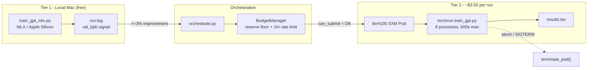
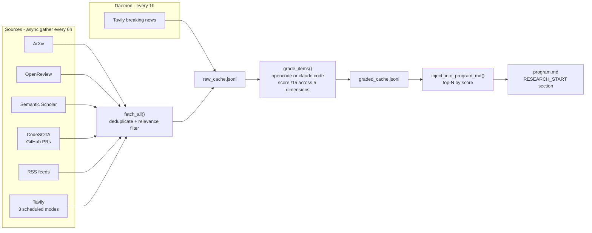

# Parameter Golf Autoresearch


---

An autonomous experiment loop for [OpenAI's Parameter Golf](https://github.com/openai/parameter-golf) challenge, expanded from the brilliance of Karpathy's [autoresearch](https://github.com/karpathy/autoresearch).

---

[Parameter Golf](https://github.com/openai/parameter-golf) asks you to train the best language model you can under simultaneous hard constraints: the entire artifact — code plus compressed weights — must fit in 16MB, training gets 10 minutes on 8×H100 SXMs, and the model can't phone home during evaluation. The metric is bits per byte on FineWeb. It's a compression problem dressed as an ML competition, and the leaderboard moves fast — the current SOTA (1.1194 bpb) combines int6 quantization, parameter banking, test-time training, and a custom bigram tokenizer, all inside a 16MB envelope. Staying competitive means tracking what others are shipping and testing new ideas quickly.

Karpathy's [autoresearch](https://github.com/karpathy/autoresearch) demonstrated that an agent can run this kind of experiment loop autonomously: modify a training script, train, evaluate, keep or revert, repeat. The core loop is simple and it works — about 12 experiments per hour on a single GPU, designed to run overnight. I wanted to apply that same idea to Parameter Golf, but the challenge adds constraints that autoresearch wasn't designed for. The official runs require 8×H100s at ~$20/hour, so you can't just loop freely — you need cost-aware gating between cheap local validation and expensive official runs. The competition is also a moving target; an agent that only sees its own code will miss techniques that other competitors publish mid-challenge. And the artifact size constraint needs continuous enforcement, not just loss optimization.

This project keeps autoresearch's modify-train-evaluate-decide loop at the center, then adds the infrastructure around it: a two-tier compute model that uses local MLX runs as a free scratchpad before promoting to RunPod, a research pipeline that ingests papers and competitor activity from 10 sources and grades them against the challenge's specific constraints, and a budget manager that enforces hard spend caps with atexit pod termination as a safety net. MLX is your scratchpad; RunPod is your printer.

## Architecture



## How It Works

The experiment loop is the central unit of work. Each cycle starts with a hypothesis, a local artifact size check (`python measure_artifact.py`), and a 500-iteration MLX smoke run. If local `val_bpb` drops at least 3% relative to the running baseline, the commit qualifies for promotion. The agent calls `python orchestrate.py --promote <commit_hash>`, which triggers the full Tier 2 flow: budget check, pod launch, rsync of `train_gpt.py` and data, `torchrun` across 8 GPUs, log retrieval, pod termination, and an append to `results.tsv`.

The orchestrator never blocks the experiment loop. After queuing a promotion, the agent continues Tier 1 experiments and checks `results.tsv` periodically. If a RunPod result confirms the improvement, the branch advances. If it's worse than the MLX signal predicted, the agent investigates the PyTorch translation. Architecture changes that work in MLX don't always transfer cleanly to PyTorch at scale, and that delta is worth understanding.

Budget enforcement operates on two axes. `BudgetManager.can_submit()` blocks any Tier 2 submission if the remaining balance is below the configured reserve floor. A separate one-hour rate limit prevents back-to-back submissions even when runs finish quickly. Both checks persist across process restarts in `budget.json`.

Pod lifecycle safety works via two mechanisms. `RunPodClient._cleanup_all` registers as both an `atexit` handler and a `SIGTERM` handler at construction time. If the orchestrator dies for any reason, any active pod gets terminated. At $20/hour for 8xH100s, a hung pod costs roughly $0.33/minute to forget about.

## Research Pipeline

The research loop runs every 6 hours by default. A separate daemon thread checks Tavily's breaking news endpoint every hour, which catches competition-specific preprints and blog posts that wouldn't show up in a standard ArXiv batch crawl.



Each paper gets scored across five dimensions: `bpb_impact`, `size_compatibility`, `time_compatibility`, `implementability`, and `novelty`. The grader knows the current SOTA, the techniques already on the leaderboard, and the hard artifact and training constraints. A paper that requires a new pip dependency, pushes the 16MB limit, or would exceed 600s of training time scores low on `implementability` or `time_compatibility` regardless of the underlying idea's quality. The top 12 scored items, by default, get injected into the `## Research Context` section of `program.md`, which is the agent's working context.

For ad-hoc lookups mid-experiment, the agent can call `python research/sources/tavily_agent.py --query "..."` directly. This bypasses the batch pipeline and calls Tavily's extract mode for a specific question. Cost is around $0.01/call.

## Repository Structure

```
parameter-golf-autoresearch/
├── orchestrate.py          # entry point: research refresh, promotion, budget status
├── program.md              # agent working context and research injection target
├── train_gpt_mlx.py        # Tier 1 training script (MLX, Apple Silicon)
├── train_gpt.py            # Tier 2 training script (PyTorch, torchrun)
├── measure_artifact.py     # artifact size check: code + zstd-compressed weights, <=16MB
├── compute/
│   ├── budget.py           # BudgetManager: spend tracking, reserve floor, rate limiting
│   ├── runpod_client.py    # pod lifecycle: launch, poll, terminate, atexit cleanup
│   └── sync.py             # rsync push/pull and remote torchrun over SSH
├── research/
│   ├── fetch.py            # async gather from all sources, deduplication, cache write
│   ├── grade.py            # LLM grading in batches of 10, five-dimension scoring
│   ├── inject.py           # top-N injection into program.md RESEARCH_START section
│   └── sources/            # one module per source (arxiv, openreview, semantic_scholar, ...)
├── data/                   # FineWeb token data for training
├── runpod_results/         # logs pulled from completed RunPod runs
├── results.tsv             # run history: commit, tier, val_bpb, artifact_bytes, cost
├── budget.json             # persisted spend state
├── raw_cache.jsonl         # fetched research items
└── graded_cache.jsonl      # scored research items
```

## Setup

1. Clone the repo and install dependencies:
   ```bash
   git clone https://github.com/you/parameter-golf-autoresearch
   cd parameter-golf-autoresearch
   pip install -e .
   ```

2. Copy the env template and fill in the required keys:
   ```bash
   cp .env.example .env
    # minimum required: RUNPOD_API_KEY, RUNPOD_TEMPLATE_ID, GITHUB_TOKEN
   ```

3. Download FineWeb token data into `data/` per the challenge instructions.

4. Run a baseline MLX smoke test and record the result:
   ```bash
   RUN_ID=local_baseline ITERATIONS=500 TRAIN_SEQ_LEN=512 python3 train_gpt_mlx.py > run.log 2>&1
   grep "^val_bpb:" run.log
   # set LOCAL_BASELINE=<result> in .env
   ```

5. Start the orchestrator:
   ```bash
   python orchestrate.py
   ```

6. Check budget status at any time:
   ```bash
   python orchestrate.py --budget-status
   ```

7. Manually promote a commit to RunPod:
   ```bash
   # dry-run first to confirm the budget check passes
   python orchestrate.py --promote <commit_hash> --dry-run
   python orchestrate.py --promote <commit_hash>
   ```

## Environment Variables

| Variable | Required | Default | Description |
|---|---|---|---|
| `RUNPOD_API_KEY` | Yes | | RunPod compute layer |
| `RUNPOD_TEMPLATE_ID` | Yes | `y5cejece4j` | Official Parameter Golf RunPod template |
| `GITHUB_TOKEN` | Yes | | GitHub PR and commit fetching |
| `GRADING_HARNESS` | No | `auto` | Which coding agent grades research: `auto`, `opencode`, or `claude` |
| `TAVILY_API_KEY` | No | | Web search and extract; disables Tavily sources if unset |
| `TOTAL_COMPUTE_CREDITS` | No | `500.00` | Starting credit balance for spend tracking |
| `RUNPOD_MIN_RESERVE` | No | `50.00` | Hard floor, Tier 2 submissions blocked below this |
| `REFRESH_HOURS` | No | `6` | Research pipeline refresh cadence in hours |
| `TOP_N_INJECT` | No | `12` | Max research items injected into program.md |
| `SINCE_HOURS` | No | `48` | Lookback window for new papers and posts |
| `LOCAL_PROMOTION_THRESHOLD` | No | `0.97` | Required local val_bpb ratio to baseline to qualify for promotion |
| `LOCAL_BASELINE` | No | | Set after your first MLX baseline run |
| `S2_API_KEY` | No | | Semantic Scholar API key for higher rate limits |
| `TAVILY_MONTHLY_BUDGET_USD` | No | `5.00` | Soft cap on Tavily spend |
| `TAVILY_HOURLY_BREAKING_NEWS` | No | `true` | Enable the hourly Tavily news daemon thread |

## Cost Model

Two cost surfaces matter: RunPod compute and Tavily search. Research grading runs through your existing coding agent (opencode or claude code), so it costs whatever your configured model costs per token — no separate API key needed.

RunPod dominates. At roughly $2.50/hour per GPU, the 10-minute training window costs around $3.33 at minimum. Pod startup and sync overhead bring the real number closer to $3.50. The budget manager calculates cost from actual wall-clock duration: `(seconds / 3600) * gpu_count * (hourly_rate / 8)`. With `TOTAL_COMPUTE_CREDITS=500` and `RUNPOD_MIN_RESERVE=50`, you have roughly 128 Tier 2 runs before hitting the reserve floor. The one-run-per-hour rate limit means a continuous session can't burn through that in less than five days.

Research grading shells out to your coding agent in headless mode (opencode or claude code), so each batch of 10 items is one agent invocation. A full 6-hour refresh typically grades 20 to 50 items in 2-5 batches. The cost depends on your configured model — it's whatever you'd pay for a few thousand tokens of reasoning per batch.

Tavily adds up if you leave the breaking news daemon running continuously or fire many ad-hoc queries. `TAVILY_MONTHLY_BUDGET_USD` is a soft reminder, not a hard cap. The code doesn't enforce it.

## The Systems Problem

The challenge presents itself as an ML optimization problem, but most of the interesting engineering lives in the infrastructure around the model. The metric is `val_bpb` and the model changes happen in two Python files, but the harder problems are: how do you prevent a hung pod from draining your account, how do you route research signal into an agent's context without overwhelming it, how do you decide which local improvements are worth paying $3.50 to validate, and how do you maintain a clean audit trail across hundreds of experiments on two different hardware targets?

The answers here are deliberately unclever. `atexit` handles the pod lifecycle. A five-dimension LLM grader handles the research signal. The 3% local threshold handles the promotion gate. `results.tsv` handles the audit trail. None of it is surprising, but it's the kind of plumbing that needs to exist before you can run experiments reliably at any volume. The model is rarely the hard part; the system around it is.
